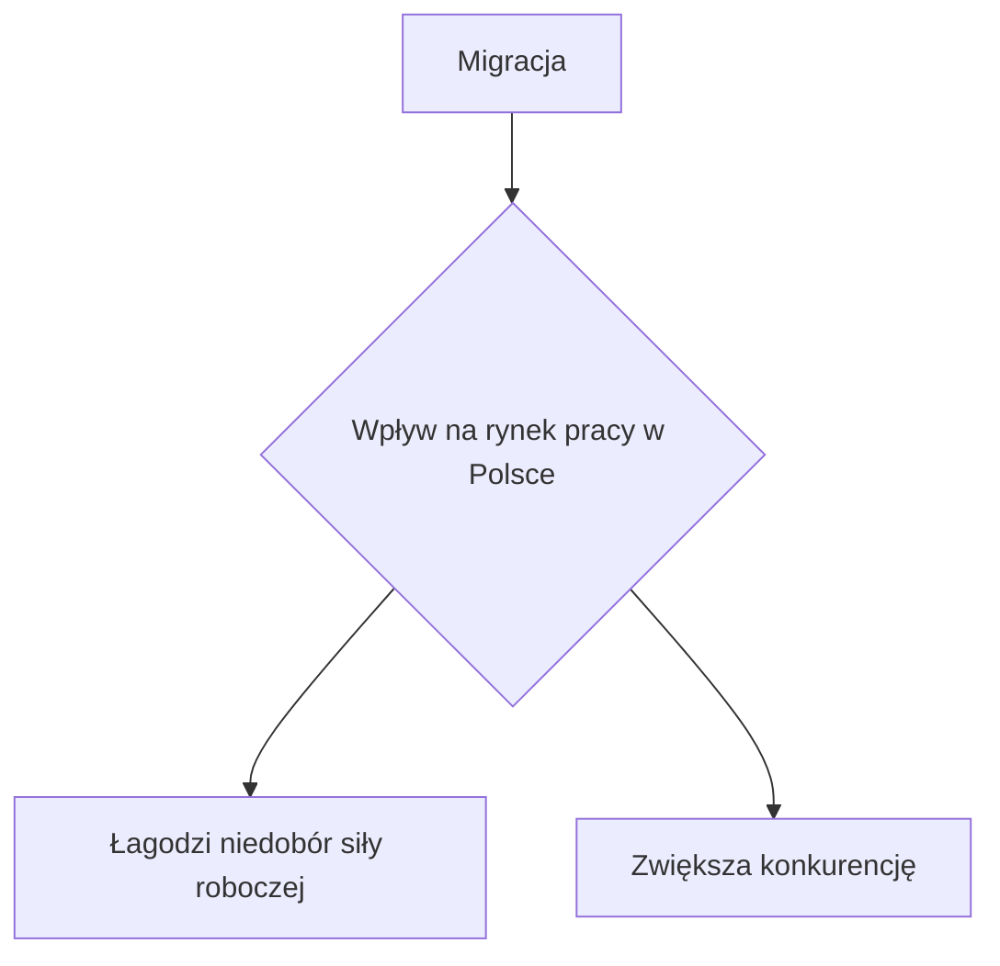
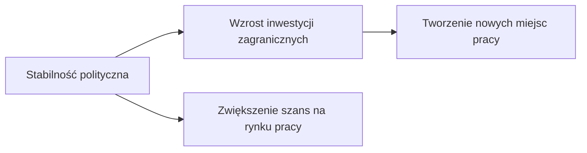

# Szanse Polaków na rynku pracy do 2030 roku

Analiza rynku pracy i sytuacji geopolitycznej w Europie
+ PracaPrzyszłości
+ Technologia
+ RynekPracy
+ Automatyzacja
+ Innowacje

## Badanie

### 🚀 Polska na fali przyszłości pracy!
🌟 37% Polaków patrzy na zmiany w pracy z entuzjazmem, gotowych na nowe wyzwania i sukcesy. Choć 40% odczuwa niepokój, przyszłość rynku pracy widziana jest przez naszych krajanów w znacznie bardziej optymistycznych barwach niż na świecie, gdzie 50% jest pełnych nadziei, a 33% zaniepokojonych. 

### Czy technologia to zagrożenie, czy szansa? 
57% Polaków jest przekonanych, że otwiera ona więcej drzwi niż ich zamyka. Automatyzacja budzi obawy co do miejsc pracy u 2/3 z nas, ale 45% nie boi się o własną karierę zawodową. To znakomity wynik w porównaniu z globalnymi trendami! 

### 🛠️ Wiara w nieustający rozwój stoi po naszej stronie
53% pracowników w Polsce nie obawia się, że technologia zdezaktualizuje ich zawód w ciągu najbliższych 5 lat, a 52% spodziewa się, że zmiany technologiczne będą miały pozytywny wpływ na ich przyszłość zawodową. 

### 🔍 Gdzie leży klucz do przyszłego rynku pracy? 
51% Polaków wskazuje na szybki postęp technologiczny, dalej pojawia się zmiana preferencji pracowników (49%), a także zmiany demograficzne (43%) i kwestie związane ze środowiskiem (42%). 

### W jakim stopniu zgadzasz się lub nie zgadzasz z następującymi stwierdzeniami?

+ [Przyszłość rynku pracy - obawy i nadzieje pracowników](https://www.pwc.pl/pl/publikacje/przyszlosc-rynku-pracy-polska-perspektywa-badanie-2021.html)

# Szanse Polaków na rynku pracy do 2030 roku - Analiza rynku pracy i sytuacji geopolitycznej w Europie

Analiza szans Polaków na rynku pracy w kontekście zmian gospodarczych, rosnącej automatyzacji przemysłu oraz sytuacji geopolitycznej w Europie jest niezbędnym elementem prognozowania przyszłości zawodowej narodu. Poniższa analiza została oparta na aktualnych trendach demograficznych, technologicznych oraz politycznych.

## Zmiany na Rynku Pracy

### Automatyzacja i robotyzacja

W poszukiwaniu wydajności i redukcji kosztów, firmy stawiają na automatyzację procesów produkcyjnych oraz usług. Oznacza to przesunięcie zapotrzebowania na siłę roboczą od pozycji wymagających niskich kwalifikacji, do tych, które potrzebują zaawansowanej wiedzy technologicznej i umiejętności adaptacyjnych.

### Demografia

Starzenie się społeczeństwa europejskiego będzie miało bezpośredni wpływ na rynek pracy. Spadek liczby ludności w wieku produkcyjnym oraz rosnąca liczba emerytów zwiększą zapotrzebowanie na pracowników w sektorze opieki zdrowotnej.

## Sytuacja Geopolityczna w Europie

### Wpływ migracji

Zjawisko migracji zarobkowej, zarówno wewnątrz kraju, jak i transgranicznej, będzie miało znaczący wpływ na lokalne rynki pracy. Migranci mogą łagodzić problem niedoboru siły roboczej w niektórych sektorach, lecz również zwiększać konkurencję na rynku pracy.

### Stabilność polityczna i ekonomiczna

Stabilność polityczna w regionie, w tym w Polsce, jest kluczowym czynnikiem przyciągającym inwestycje zagraniczne, stanowiąc podstawę dla tworzenia nowych miejsc pracy oraz zwiększania szans Polaków na rynku pracy.

## Wnioski

Analiza wskazuje, że szanse Polaków na rynku pracy do 2030 roku będą kształtowane przez szereg czynników, w tym przez zmiany technologiczne, demograficzne oraz sytuację geopolityczną w Europie. Kluczowe działania, które mogą zwiększyć te szanse to:

- Inwestycje w edukację i przekwalifikowanie pracowników, szczególnie w kierunku technologii informacyjnych i opieki zdrowotnej.
- Promowanie innowacji i wsparcie dla sektora badań i rozwoju.
- Zapewnienie stabilnego środowiska politycznego i prawno-gospodarczego zachęcającego do inwestycji.

